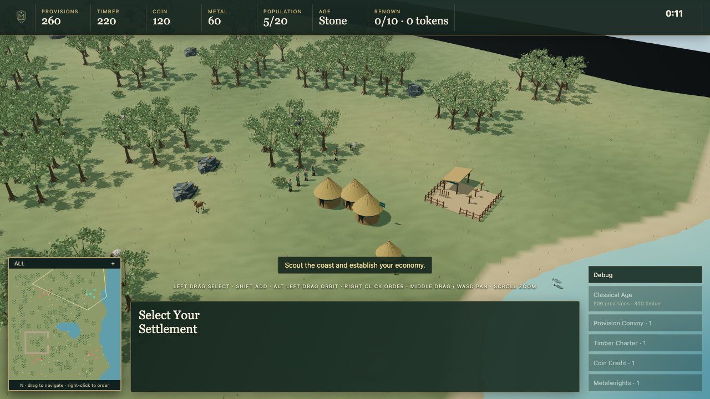
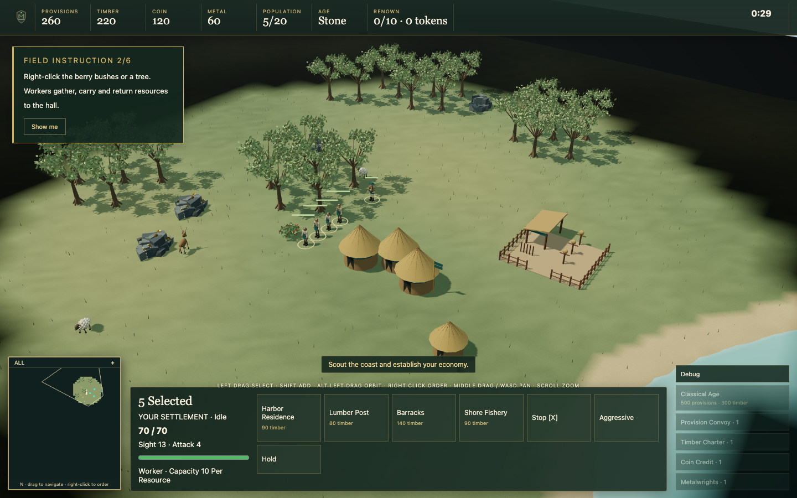
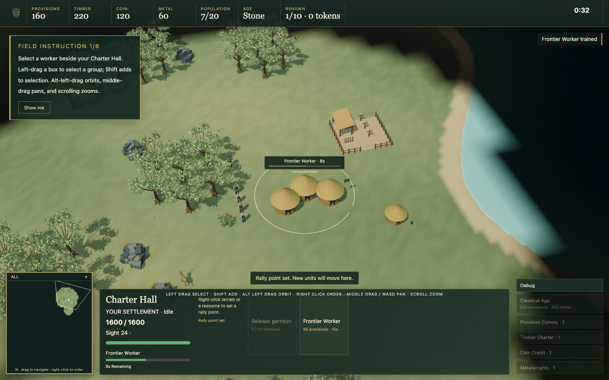
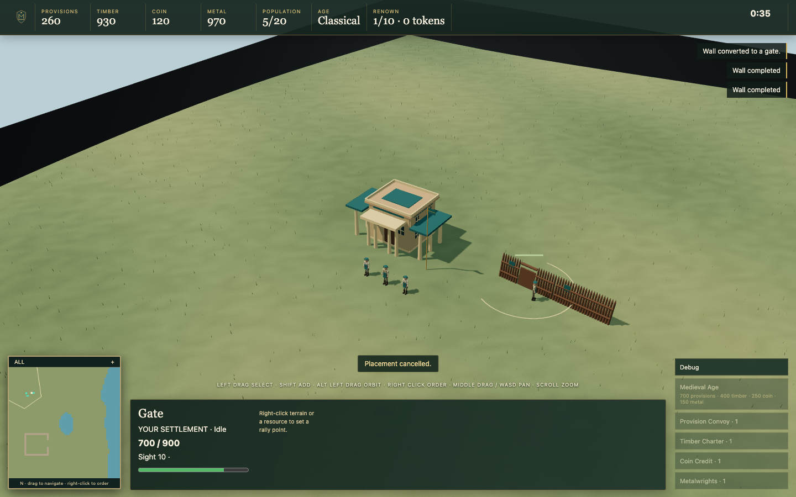
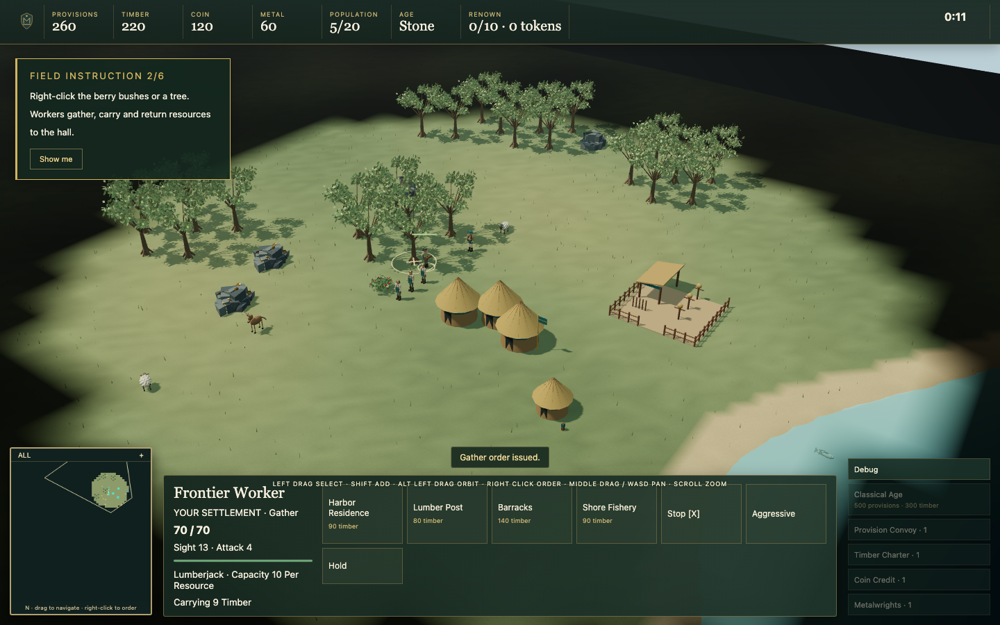
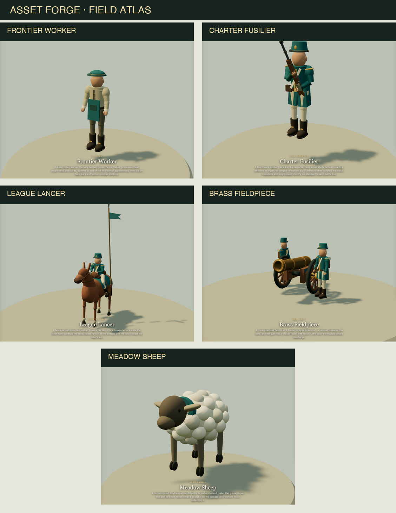

# Empires of Meridian

**A 3D browser RTS about building a frontier, protecting its people, and turning a coast into a league.**

Empires of Meridian is an original real-time strategy game built around a deterministic simulation, a procedural temperate-coast world, and a presentation layer designed for readable play from the strategic view to the individual unit. The current build is an offline vertical slice: start a match, gather resources, construct a settlement, raise an army, advance through the first ages, and test the opposing AI.

<p align="center">
  
</p>

<p align="center"><sub>Temperate Coast skirmish view · procedural terrain, fog of war, resources, wildlife, production, and coastal play</sub></p>

## The game at a glance

| System       | What is in the slice                                                                                                                               |
| ------------ | -------------------------------------------------------------------------------------------------------------------------------------------------- |
| World        | Seeded temperate-coast maps with forests, farms, mines, berry patches, fish grounds, wildlife, shorelines, and validated starting areas            |
| Economy      | Provisions, Timber, Coin, and Metal with gathering, carrying, drop-off, depletion, farms, fishing, hunting, and storage buildings                  |
| Settlement   | Central halls, houses, production buildings, farms, walls, gates, forts, trade structures, rally points, and construction states                   |
| Military     | Foot soldiers, mounted units, siege artillery, formations, stances, projectiles, fog, garrisoning, and deterministic combat resolution             |
| Progression  | Stone, Classical, and Medieval ages with research, production queues, council choices, Renown, and Dispatch events                                 |
| Opposition   | Relaxed, Standard, and Ruthless modes using the same legal-information AI architecture with different decision budgets                             |
| Presentation | Three.js world rendering, procedural assets, animation states, field lens controls, generated audio cues, minimap, and readable selection feedback |

## A closer look

The map is built to reward readable decisions. A worker can be selected, sent to a specific resource, carry the result back to a valid drop-off, and continue the local resource loop as nearby nodes are depleted. Production buildings expose their queue and rally point directly in the world. Seven timed technologies improve the settlement, including a real militia-to-swordsman upgrade; queued research and training can be cancelled with an explicit refund. Walls, gates, and age changes make the settlement legible from a distance.

<table>
  <tr>
    <td width="50%"><br><sub>Tutorial field · selection, fog, resource access, and worker orders</sub></td>
    <td width="50%"><br><sub>Production and rally point · the queue stays attached to the building</sub></td>
  </tr>
  <tr>
    <td width="50%"><br><sub>Defensive growth · walls and gates remain readable as the settlement evolves</sub></td>
    <td width="50%"><br><sub>Resource loop · carried resources and the active work target are visible</sub></td>
  </tr>
</table>

## Units and assets

The Asset Forge is the visual reference shelf for the project. It exposes the current procedural models, age availability, animation states, descriptions, and design roles. The atlas below brings several of those references together so the silhouettes can be compared at a glance.

<p align="center">
  
</p>

<p align="center"><sub>Asset Forge field atlas · civilian, infantry, mounted, artillery, and wildlife silhouettes</sub></p>

The field cannon is a crew-operated unit rather than a decorative prop: its crew loads, rams, clears the muzzle, fires a visible round, and recovers from recoil. Workers, soldiers, mounted units, animals, buildings, and environmental resources use the same content and presentation mapping so the live match and Forge stay aligned.

## Run the build

Requirements:

- Node.js 22 or later
- pnpm 11 or later

```sh
pnpm install
pnpm dev
```

Open [http://127.0.0.1:5173](http://127.0.0.1:5173). The default route opens the playable menu. In a development build, the original Temperate Coast showcase and the Asset Forge are available at `/dev/forge`.

For the local service foundation, Docker Desktop is optional. The offline match remains usable when the development API and game server are unavailable.

## Useful commands

```sh
pnpm typecheck    # strict TypeScript validation
pnpm lint         # ESLint across application, simulation, tools, and tests
pnpm test:unit    # deterministic simulation and content tests
pnpm test         # browser launch, interaction, and visual regression coverage
pnpm build        # production web build
```

The production bundle is written to `apps/web/dist/` and is ignored by Git.

## Controls

- Drag empty terrain to orbit the camera.
- Scroll to zoom; use WASD or middle-drag to pan.
- Shift-drag to box-select; Shift-click to add to the current selection.
- Click a unit, building, resource, or animal to inspect it.
- Right-click for contextual movement, work, combat, construction, fishing, hunting, or garrison orders.
- Right-click with a production building selected to set its rally point.
- Ctrl/Cmd + 1–9 assigns a control group; 1–9 selects it.
- Space focuses the selection; X stops it.

The match setup supports map seed, map size, fog of war, population cap, game speed, player colour, and AI difficulty. The development Field Lens controls lighting, weather, animation, and render quality. Farms accept two workers; completed halls and forts can shelter villagers.

## Repository map

```text
apps/web/                 React shell, offline match, simulation worker, showcase, and Asset Forge
apps/api/                 Development HTTP service
apps/game-server/         Transport foundation
packages/sim/             Fixed-tick economy, navigation, combat, visibility, and AI
packages/protocol/        Versioned commands, snapshots, saves, and worker messages
packages/content/         Validated gameplay definitions and stable content IDs
packages/presentation/    Snapshot-to-render intents and pooled entity views
packages/asset-tools/     Original procedural models, materials, and animation rigs
tests/                    Placement, geometry, animation, audio, and browser regression tests
docs/images/              Curated README captures from the current build
```

## Project status

The current repository is a playable offline vertical slice with fixed-tick simulation, deterministic saves, economy, construction, production, progression, combat, fog, wildlife, audio feedback, procedural presentation, and an actively evaluated AI opponent. Multiplayer, additional factions, naval combat depth, and the final cross-browser and hardware release gates remain later work. The status of the latest verification pass is recorded in [`PROJECT_STATE.md`](PROJECT_STATE.md).

## Contributing and asset provenance

Keep gameplay rules in `packages/content` and `packages/sim`; keep rendering and animation in the presentation and asset layers. New visuals should remain original, procedural, or clearly documented. See [`THIRD_PARTY_ASSETS.md`](THIRD_PARTY_ASSETS.md) before adding external material, and keep generated build output, secrets, database volumes, and local captures out of version control.

## Git setup

After creating an empty repository on your Git host, run:

```sh
git remote add origin <YOUR_REPOSITORY_URL>
git add .
git commit -m "Initial visual prototype"
git branch -M main
git push -u origin main
```

If Git reports an Xcode license error on macOS, accept it with:

```sh
sudo xcodebuild -license
```
